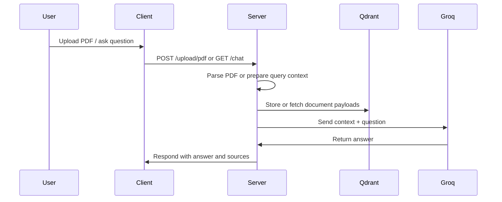

# Architecture

This project is a local PDF RAG system with a browser UI, a server API, a vector database, and optional background indexing support.

## System Goal

The goal is to let a user:

1. Sign in through Clerk.
2. Upload one or more PDF files.
3. Persist those files locally.
4. Index the document text into Qdrant.
5. Ask questions and receive answers grounded in retrieved document content.

The current implementation favors local simplicity over production-grade infrastructure. It is easy to run on one machine, but the retrieval layer should be upgraded before treating it as a high-scale or high-accuracy RAG system.

## Components

- `client/` - Next.js interface for sign-in, upload, and chat
- `server/` - Express API for uploads and retrieval
- Qdrant - stores document content and metadata for retrieval
- Valkey - supports the BullMQ queue used by the worker
- Groq - generates the final answer using retrieved context

## Runtime Boundaries

The app is split into four runtime boundaries:

- Browser runtime
  - Renders the UI
  - Handles file selection and question entry
  - Calls the Express API over HTTP

- Next.js server runtime
  - Serves the React app
  - Checks Clerk auth state before rendering the workspace

- Express runtime
  - Accepts uploads
  - Parses PDFs
  - Stores indexed content in Qdrant
  - Fetches relevant context for chat
  - Calls Groq for final generation

- Infra runtime
  - Qdrant stores retrieved document payloads
  - Valkey supports the BullMQ worker path

## High-Level Flow

```text
Browser
  -> Next.js client
    -> Express server
      -> PDF parsing
      -> Qdrant storage
      -> Groq answer generation
```

## Sequence View



## Request Flow

### Authentication

1. The app opens through the Next.js client.
2. Clerk guards the main workspace.
3. Signed-out users are redirected to `/auth`.
4. Signed-in users can access the main PDF chat workspace.

### UI Shell

1. `client/app/layout.tsx` wraps the app in `ClerkProvider`.
2. The signed-in shell shows the upload and chat workspace.
3. The signed-out shell shows the auth page.

### Upload Flow

1. The user selects a PDF in the client.
2. The client sends `multipart/form-data` to `POST /upload/pdf`.
3. The server stores the file in `server/uploads/`.
4. The server parses the PDF with LangChain's `PDFLoader`.
5. The extracted text and metadata are stored in Qdrant.
6. The UI marks the file as ready after indexing succeeds.

The worker file still exists, but the live upload path now performs indexing synchronously. That means a successful upload means a searchable document is already in Qdrant.

### Chat Flow

1. The user asks a question in the client.
2. The client calls `GET /chat?message=...`.
3. The server fetches stored PDF documents from Qdrant.
4. The server ranks the documents against the query.
5. The best matches are assembled into a context block.
6. The context and question are sent to Groq.
7. The model response is returned to the browser together with the retrieved sources.

## API Surface

### `POST /upload/pdf`

- Accepts `multipart/form-data`
- Expects a field named `pdf`
- Stores the file locally
- Parses the PDF
- Indexes the extracted content into Qdrant
- Returns a success payload only after indexing completes

### `GET /chat?message=...`

- Accepts a plain query string
- Uses the query to rank indexed documents
- Builds a text context from the best matches
- Sends the context to Groq
- Returns:
  - `message`: the generated answer
  - `docs`: the retrieved source documents

## Data Storage

- Raw uploaded files live in `server/uploads/`
- Qdrant collection: `pdf-documents-langchain`
- Document payload shape:
  - `content`: full extracted text
  - `metadata.filename`: original filename
  - `metadata.path`: stored file path
  - `metadata.destination`: upload directory
  - `metadata.pages`: page metadata array from `PDFLoader`
- Runtime secrets live in local `.env` files only

## Retrieval Strategy

The current retrieval strategy is intentionally simple:

1. Pull all stored PDF payloads from Qdrant.
2. Score them against the query with term and phrase matching.
3. Keep the top matches.
4. Send those matches as context to Groq.

This works locally and is deterministic, but it is not a semantic embedding pipeline. The current `SimpleEmbeddings` class is a placeholder that keeps the code runnable without calling an external embedding provider.

## Local Services

`docker-compose.yml` starts the local infra:

- Qdrant on port `6333`
- Valkey on port `6379`

The current app flow uses Qdrant directly for retrieval. Valkey remains available for the BullMQ worker path.

## Deployment Model

The project is easiest to run as three processes plus two containers:

1. `docker compose up -d`
2. `cd server && pnpm run dev`
3. `cd client && pnpm run dev`

That gives you:

- Browser UI on `http://localhost:3000`
- Express API on `http://localhost:8000`
- Qdrant on `http://localhost:6333`
- Valkey on `localhost:6379`

For deployment, the boundaries are still the same. The browser talks to the client app, the client talks to the server API, and the server talks to Qdrant, Valkey, and Groq.

## Server Modules

- `server/index.js`
  - Express app
  - upload endpoint
  - chat endpoint
  - Qdrant access
  - Groq access

- `server/worker.js`
  - BullMQ worker
  - PDF loading
  - document indexing path

- `server/uploads/`
  - persistent local storage for uploaded PDFs

## Client Modules

- `client/app/page.tsx`
  - Auth gate and workspace entry point

- `client/app/auth/page.tsx`
  - Sign-in and sign-up screen

- `client/app/components/rag-chat.tsx`
  - Upload UI
  - Chat UI
  - source display

- `client/app/layout.tsx`
  - Clerk provider
  - top-level navigation

## Failure Modes

The most likely failures are operational, not algorithmic:

- Qdrant not running
  - Upload indexing or chat retrieval fails

- Valkey not running
  - Worker queue path fails

- Groq key missing or invalid
  - Chat generation fails

- Clerk key missing or invalid
  - Auth gate fails

- PDF parse failure
  - Upload fails before indexing completes

- Large or noisy PDFs
  - Retrieval quality drops because the current ranking is lexical, not semantic

## Security Model

The current security model is lightweight:

- Clerk protects access to the workspace in the client
- The server trusts its local environment variables for external integrations
- Uploaded files are stored locally without user-specific isolation

That is acceptable for a personal or local deployment. For a multi-user deployment, you would want:

- Per-user document ownership in Qdrant payloads
- Strict server-side auth checks on upload and chat routes
- File size and type validation
- Rate limiting
- Temporary file cleanup

## Data Model Notes

The app stores one Qdrant point per uploaded PDF document, not one point per chunk. That keeps the implementation compact, but it reduces retrieval precision for long documents because the full text is treated as one unit.

The natural next step is chunked indexing:

- split each PDF into smaller text blocks
- store chunk IDs and page metadata
- retrieve only the most relevant chunks
- feed a smaller context window to the model

## Operational Notes

- Uploaded files are written to `server/uploads/`
- The server should be started from the `server/` directory so local env loading resolves correctly
- The client uses `http://localhost:8000` as its API base
- The worker exists as a compatibility path and can be reused for background ingestion if needed

## Extending The System

Useful future upgrades:

- Replace the placeholder embedding logic with a real embedding model
- Split PDF text into smaller chunks before indexing
- Re-enable the queue-backed ingestion path for heavier workloads
- Add per-user document scoping in Qdrant payloads
- Add re-indexing and delete-document endpoints
- Add per-document deletion from local disk and Qdrant
- Add upload progress and indexing status polling
- Add document list and search history views

