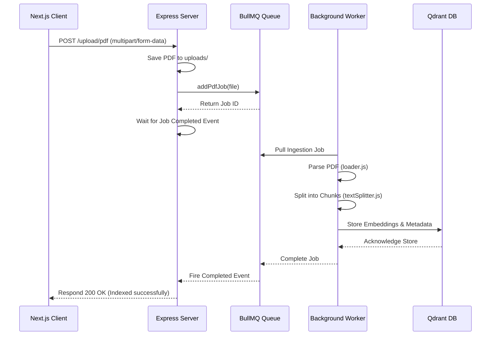
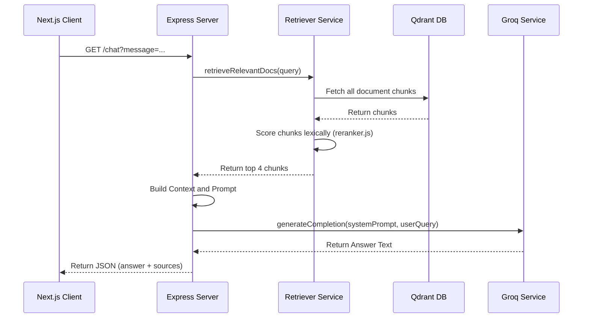

# Architecture

This project implements a production-grade local PDF RAG (Retrieval-Augmented Generation) system with a browser UI, a modular Express API, an asynchronous BullMQ queue, a Qdrant vector database, and an LLM answering service.

## System Goal

The system allows users to:
1. Sign in through Clerk.
2. Upload PDF files.
3. Queue documents for ingestion.
4. Parse and chunk document text to index into Qdrant.
5. Query the documents and receive responses grounded in retrieved context.

The codebase implements a scalable, separated-concern architecture to decouple heavy workload processing (ingestion, parsing, chunking, and embedding) from user querying.

---

## Technical Stack & Infrastructure

- **Frontend**: Next.js, React, TypeScript, Tailwind CSS
- **Auth**: Clerk
- **API**: Express.js (ES Modules)
- **Queue**: BullMQ with Valkey (Redis-compatible) cache database
- **Vector Database**: Qdrant
- **Ingestion**: LangChain Community PDF Loader
- **LLM / Generation**: Groq (Llama 3.3)
- **Embeddings**: Local `SimpleEmbeddings` (mock dimension 1) for zero-setup execution

---

## Component Boundaries

The project is structured into three execution realms:

```text
               +-----------------------------+
               |         Next.js UI          |  (Browser & Client Server)
               +--------------+--------------+
                              | HTTP
                              v
               +--------------+--------------+
               |      Express API Server     |  (Producer)
               +-------+--------------+------+
                       |              ^
                 Queue |              | Wait for Finish
                       v              |
               +-------+--------------+------+
               |    BullMQ Worker Process    |  (Consumer)
               +-------+--------------+------+
                       |              |
                       v              v
                 +-----+----+   +-----+----+
                 |  Qdrant  |   |  Valkey  |    (Infrastructure)
                 +----------+   +----------+
```

1. **Client / Frontend (`client/`)**
   - Single-page application serving as the UI workspace.
   - Guarded by Clerk authentication.
   - Connects to the Express backend over HTTP.

2. **Express API Server (`server/src/app.js`)**
   - Receives uploads and writes them to local storage.
   - Pushes ingestion jobs to the BullMQ queue and awaits completion via event listeners.
   - Orchestrates query searches by calling the retriever and feeding context to the LLM.

3. **BullMQ Queue Worker (`server/src/queue/workers/pdfWorker.js`)**
   - Independent background worker process.
   - Extracts, chunks, and indexes documents into Qdrant.

4. **External Services & Infrastructure**
   - **Qdrant**: Local vector database storing document text and metadata.
   - **Valkey**: Key-value cache supporting BullMQ queue operations.
   - **Groq**: High-speed LLM model generation.

---

## Detailed Directory Layout

Following the premium architecture pattern, the back-end is structured under `server/src/` as follows:

```text
server/
├── src/
│   ├── config/
│   │   └── env.js              # Environment variable parsing and defaults
│   │
│   ├── ingestion/
│   │   ├── loader.js           # PDF parsing using LangChain loaders
│   │   └── pdf.js              # Ingestion data formatting
│   │
│   ├── chunking/
│   │   └── textSplitter.js     # Custom Recursive Character Text Splitter
│   │
│   ├── embeddings/
│   │   └── embeddingService.js # Local SimpleEmbeddings model registry
│   │
│   ├── vectorstore/
│   │   ├── qdrant.js           # Qdrant client connection and point operations
│   │   └── index.js            # Vector store exports
│   │
│   ├── retrieval/
│   │   ├── retriever.js        # Lexical matching search router
│   │   └── reranker.js         # Lexical ranking scoring algorithm
│   │
│   ├── llm/
│   │   └── chat.js             # Groq LLM completion service
│   │
│   ├── prompts/
│   │   └── ragPrompt.js        # Prompt template constructor for RAG answers
│   │
│   ├── queue/
│   │   ├── jobs/
│   │   │   └── pdfJob.js       # BullMQ Job queue creator
│   │   └── workers/
│   │       └── pdfWorker.js    # BullMQ worker doing background ingestion
│   │
│   ├── api/
│   │   ├── health.js           # GET / health handler
│   │   ├── upload.js           # POST /upload/pdf handler
│   │   └── chat.js             # GET /chat handler
│   │
│   └── app.js                  # Express setup, middleware, and route maps
│
├── uploads/                    # Local storage of PDF files
└── package.json                # Server scripts and dependencies
```

---

## Request Flows

### 1. File Upload and Ingestion Flow

The upload flow uses a hybrid synchronous-asynchronous architecture. The client gets a synchronous response, but the heavy extraction work is offloaded to the worker queue:



### 2. Retrieval and Chat Flow



---

## Ingestion Details

### Custom Text Splitter
Rather than indexing full documents, the system breaks text into logical chunks. It uses a custom `RecursiveCharacterTextSplitter` configured with:
* `chunkSize`: `1000` characters
* `chunkOverlap`: `200` characters

This ensures that queries match localized paragraphs/sentences containing precise facts, boosting RAG accuracy.

### Local Mock Embedding
The project uses `SimpleEmbeddings` which produces 1-dimension mock vectors (matching document lengths). This keeps the system fully local and zero-setup. Matching is performed using term-frequency and phrase-frequency lexical scoring in `reranker.js`, and the final answer generation is routed to Groq.
